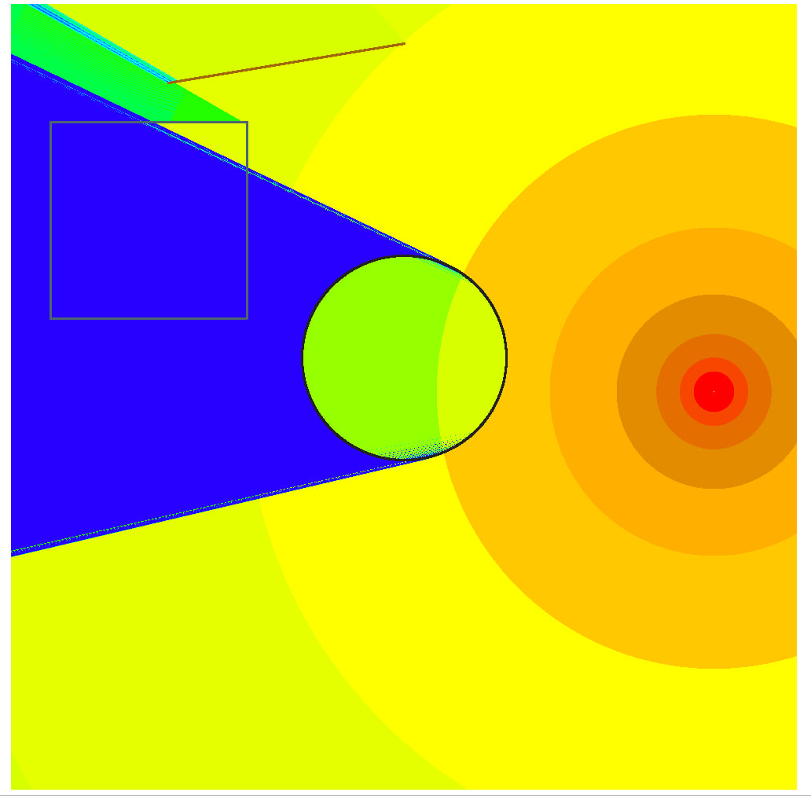

### Лабораторная работа №3. Вопросы архитектуры приложения

1. Создать новую ветку вашего **Git-проекта**. Название ветки на свое усмотрение;
2. Реализовать собственный класс “**Тепловой карты**”. Класс должен включать методы:
    1. Вычисления цвета каждого пикселя на основе мощности радиосигнала;
    2. Раскраска тепловой карты по выбранным цветам;
    3. Доп. методы. Смысловые, на свое усмотрение;
3. Реализовать класс “Propagation Model”, который должен включать в себе все модели по спецификации 3GPP 38.901;
4. Реализовать класс “Материалов”, который будет помогать считать формулу для затухания при прохождении через стены.
5. Реализовать git push на новую ветку (созданную в пункте 1);
6. Выполнить слияние новой ветки в свою основную.

Итог

